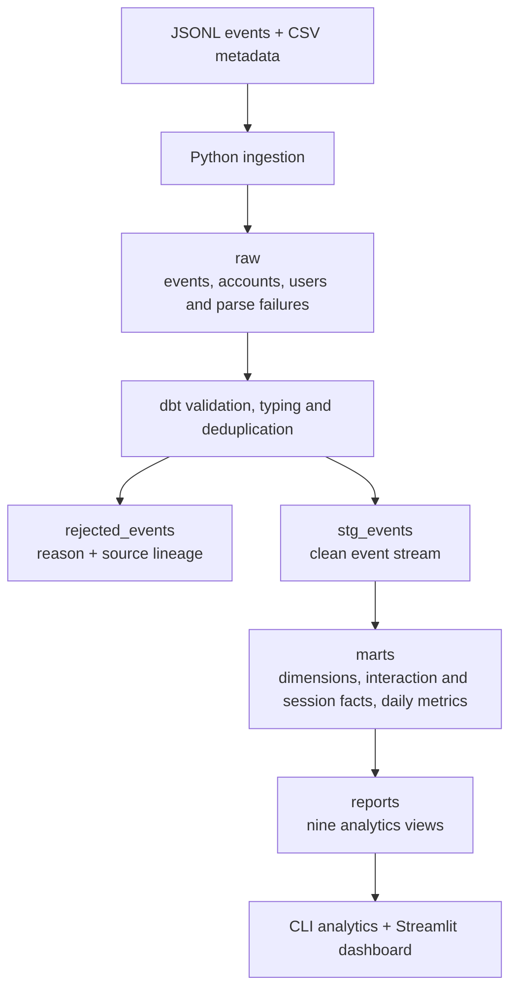
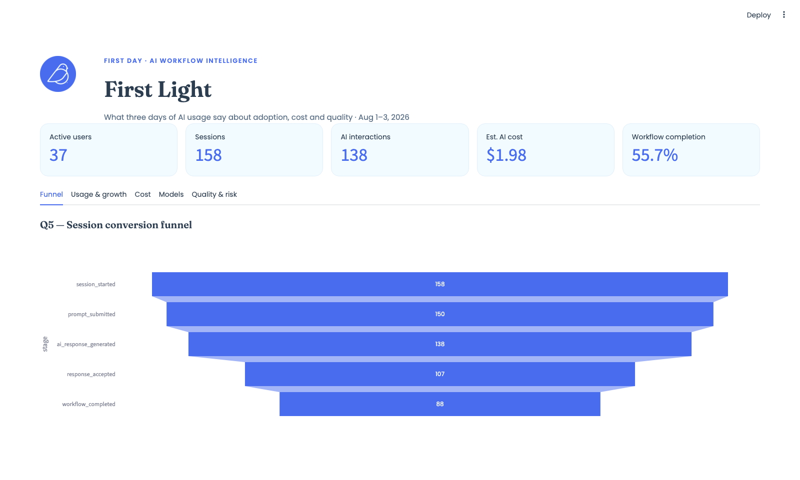

# First Day Data Engineering Take-Home

This repository is my solution to First Day's data engineering take-home. It
turns the supplied event, account, and user files into a small analytics
warehouse that can be inspected locally, tested end to end, and explored
through either SQL or a Streamlit dashboard.

I used Python for the parts that are naturally file-oriented: reading JSONL and
CSV input, preserving malformed records, and writing the validation summary.
DuckDB keeps the project self-contained, while dbt owns the transformations,
business definitions, tests, and lineage. This split makes it possible to trace
a dashboard number back through a report view and its underlying models without
having the same calculation implemented in several places.

## Running the project

The project is tested with Python 3.11 and supports Python 3.10–3.13. It also
requires `make` and the standard-library `venv` module. The commands below are
intended for macOS, Linux, or WSL; no external services or credentials are
needed. If your `python3` command points to a different version, select the
interpreter when creating the environment:

```bash
make setup PYTHON=python3.11
```

Once the environment exists, the remaining commands use `.venv` directly, so
activating it is optional.

```bash
make setup       # create .venv and install dependencies
make run         # ingest, run dbt models/tests, write validation report
make analytics   # print the answers to the analytics questions
make test        # run the pytest suite against a temporary fixture database
make dashboard   # start Streamlit at localhost:8501
make docs        # generate and serve dbt documentation at localhost:8080
make explore     # open the DuckDB UI in read-only mode
```

For a first run, use `make setup` followed by `make run`. The latter command
loads the raw files, builds every dbt model, runs the dbt tests, and writes
`data/processed/validation_report.md`. On the supplied data, the pipeline
produces 690 clean events and 35 rejected rows from 725 input lines.

## Pipeline structure



The layers have deliberately narrow responsibilities. The raw schema records
what arrived, staging decides whether an event is usable, marts define stable
business entities and grains, and report views answer the assignment's
analytics questions. I kept the complete parsed JSON payload in the raw event
table, together with the source filename, line number, and load timestamp.
Lines that cannot be parsed are stored separately with their original text.
This gives both clean and rejected records a path back to the input file.

On a rerun, ingestion replaces the rows associated with each source file before
loading it again. That is enough to make this small file-based pipeline
idempotent without introducing a separate load-control table.

## Validation and deduplication

I chose a first-failure-wins rule for validation. It gives every rejected row a
single, predictable reason and keeps the rejection report easy to read. The
checks run in this order:

| Order | Rejection reason | Check |
|---:|---|---|
| 1 | `missing_event_id` | `event_id` is absent or empty |
| 2 | `unparseable_event_ts` | `event_ts` cannot be cast to a timestamp |
| 3 | `unknown_event_name` | value is outside the expected event-name seed |
| 4 | `missing_account_id` / `missing_user_id` | required ownership fields are absent |
| 5 | `missing_session_id` | session is absent outside invite/signup events |
| 6 | `invalid_property_type` | a present numeric or boolean property has the wrong JSON type |
| 7 | `negative_metric_value` | token, latency, cost, or duration value is negative |
| 8 | `unknown_account` / `unknown_user` | metadata reference does not exist |
| 9 | `user_account_mismatch` | user belongs to a different account |
| 10 | `duplicate_event_id` | another valid copy of the event was kept |

Malformed JSON and non-object JSON values are rejected during ingestion before
these staging checks. Optional properties may be absent or explicitly `null`,
but a value that is present must match its expected JSON type. This prevents a
failed `try_cast` from silently turning malformed input into a valid null.

For duplicate IDs, I keep the first record by
`(received_ts, source_file, line_number)`. I do not reject late events: an event
is flagged when `received_ts - event_ts > 1 hour`, but it is still reported on
the date of `event_ts`.

The pipeline also checks the accounting identity below, both in dbt and in the
validation report:

```text
raw_events + raw_ingest_rejections = stg_events + rejected_events
```

The sample result is:

```text
719 + 6 = 690 + 35
```

## Models

| Model | Grain |
|---|---|
| `stg_events` | one valid event per `event_id` |
| `rejected_events` | one rejected source line or parsed event |
| `dim_accounts` | one row per account |
| `dim_users` | one row per user |
| `fact_ai_interactions` | one `ai_response_generated` event |
| `fact_sessions` | one row per `session_id` |
| `daily_account_metrics` | one row per date and account |

`dim_users` exposes only a masked email domain. I left the full address in the
raw schema because none of the requested analytics needs it.

Nine AI calls have no reported cost. For those rows, I estimate cost from the
model's observed cost per token in this sample. Reported and estimated costs
remain separate, and `is_cost_estimated` identifies the imputed rows. This is a
practical fallback for the exercise, not a substitute for provider billing
data.

## Analytics definitions

The eight requested queries are under `dbt/models/marts/reports/`. There is one
additional report comparing model acceptance, latency, and cost.

- Active user: a distinct user with at least one valid event on the day.
- AI interaction: one `ai_response_generated` event.
- Funnel: started sessions where each stage occurred at least once. Stages are
  cumulative, but strict timestamp ordering is not enforced.
- Rejection rate: rejected decisions divided by accepted plus rejected
  decisions. Calls without a decision are not part of this denominator.
- High error rate: above the eligible-user mean plus two population standard
  deviations, with a minimum of 10 events.
- Usage growth: total valid events on day 3 versus day 1. With three days of
  data this indicates direction, not a longer-term trend.

As a separate review step, the requested calculations were recomputed directly
from the raw files rather than from the dbt report views. Counts, percentiles,
costs, funnel stages, rejection rates, the error-rate threshold, and account
growth matched the materialized results.

## Dashboard

The optional dashboard is a compact way to review the output after running the
pipeline. Start it with:

```bash
make dashboard
```



Streamlit serves the app at `http://localhost:8501`. The dashboard opens the
local DuckDB database in read-only mode and queries the marts and report views
that dbt has already built. It is intentionally a presentation layer: metric
definitions stay in SQL, rather than being reimplemented in Python just for the
charts.

The top of the page summarizes active users, sessions, AI interactions,
estimated AI cost, and workflow completion. The remaining detail is organized
into five tabs:

- **Funnel** follows sessions from start through context selection, AI response,
  export, and completion. It makes the largest stage-to-stage losses visible.
- **Usage & growth** shows daily active users and compares each account's event
  volume on day 1 and day 3.
- **Cost** breaks estimated AI spend down by date, account, and model, with the
  underlying values available in a table.
- **Models** compares median and p95 latency, observed acceptance rate, and the
  interaction mix by workflow and model.
- **Quality & risk** brings together rejected responses, rejection reasons, and
  users whose error rate crosses the statistical threshold defined in the
  reporting model.

Colors remain consistent for each account across charts, and query results are
cached during the Streamlit session so switching tabs does not repeatedly scan
the database. The dashboard is useful for quickly spotting areas worth
investigating, but the report views remain the source of truth for exact values.

## dbt documentation

`make docs` generates the dbt catalog and serves it at `http://localhost:8080`.
This is the best place to inspect how a particular metric is built: the catalog
includes descriptions for models and columns, attached tests, source tables,
and lineage from ingestion through the final report views. Generated files stay
under `dbt/target/` and are not committed.

For non-interactive environments, `make docs-generate` builds the same catalog
without starting the server. CI runs this command after the pipeline build so
documentation errors fail the workflow.

## Tests

I use two test layers for different purposes.

`make test` runs 16 Pytest tests against a small fixture dataset. These cover
JSON parsing, rejection lineage, idempotent re-ingestion, raw payload
preservation, validation reasons, deterministic deduplication, late events,
invalid property types, missing-cost estimation, session aggregation, daily
metrics, row-count reconciliation, and fixed expected results for the funnel,
latency, and cost reports. The transform fixture invokes a full `dbt build`
against a temporary DuckDB database.

`make run` executes 41 dbt data tests. They check primary-key uniqueness,
required columns, non-negative metrics, relationships between events, users,
and accounts, the grain of daily metrics, and reconciliation across the raw
and staging layers. dbt reports 59 total build nodes because that total also
includes 17 models and one seed.

Three representative reporting views have fixed expected-result tests. The
remaining views are covered by the full dbt build, schema tests, and the
independent raw-file calculation review described above.

### Continuous integration

GitHub Actions runs `make test`, `make run`, and `make docs-generate` on pull
requests and pushes to `main`. The first command tests a controlled fixture;
the second builds and validates the supplied data; the last confirms that the
dbt catalog can be generated. The workflow uses Python 3.11, matching the local
development environment.

## What I found in the sample

- 55.7% of sessions with a `session_started` event reached workflow completion.
- `gpt-5.5-mini` had similar observed acceptance to `gpt-5.5` in this sample,
  with lower median latency and average estimated cost.
- Atlas Legal had the highest explicit rejection rate and lower event volume on
  the last day than on the first. I would investigate it, but three days is not
  enough evidence to call it a churn trend.
- Orbit People had the largest increase in event volume between day 1 and day 3.

## Repository layout

```text
src/ingest.py                 raw file ingestion
src/validate.py               validation summary and reconciliation gate
src/run_analytics.py          terminal output for report views
src/explore.py                read-only DuckDB browser
sql/create_tables.sql         raw schema DDL
dbt/models/staging/           typing, validation, and deduplication
dbt/models/marts/             dimensions, facts, and daily aggregate
dbt/models/marts/reports/     requested analytics queries
dbt/models/schema.yml         model documentation and dbt tests
tests/                        Pytest fixtures and integration tests
dashboard/app.py              optional Streamlit dashboard
docs/design.md                production design notes
.github/workflows/ci.yml      pull request and main-branch checks
```

The assignment suggests `src/transform.py` and `sql/marts.sql`. I used the dbt
equivalent instead: one SQL file per model, with dependencies expressed through
`ref()`.

## Submission notes

- Time spent: approximately 6 hours on the initial implementation, followed by
  a separate review and documentation pass.
- I prioritized row accounting, explainable rejection reasons, deterministic
  reruns, and explicit metric definitions.
- I deliberately skipped orchestration, incremental models, strict funnel
  ordering, cost anomaly detection, and seat-utilization metrics. They did not
  seem justified for three local files and the assignment's time limit.
- I used both Claude Code and Codex. Claude Code assisted with the initial
  implementation. Codex was used afterwards to review the repository against
  the assignment, recalculate the analytics independently, identify validation
  and documentation gaps, add the small GitHub Actions workflow, and complete
  the dbt documentation. I did not rely on generated output alone: the final
  checks included the fixture-based Pytest suite, all dbt tests, raw-to-staging
  row reconciliation, a clean dbt catalog build, and independent comparisons
  of the requested metrics.
